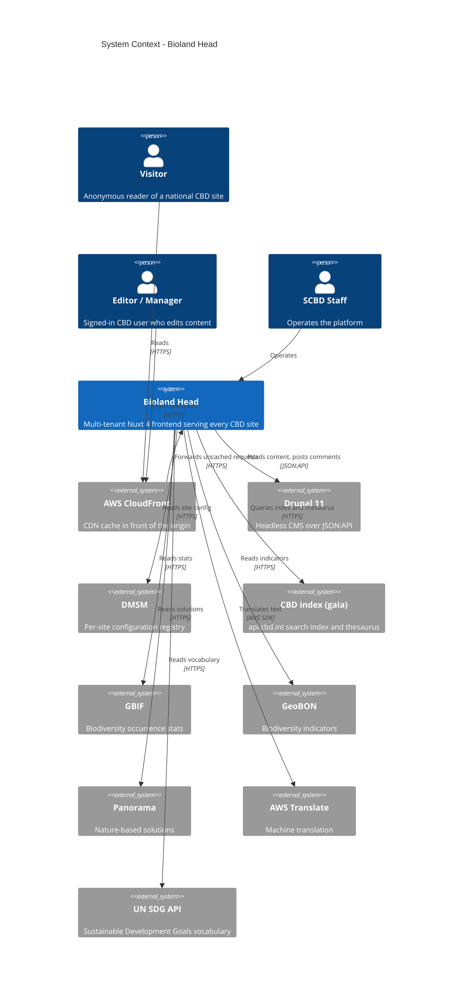
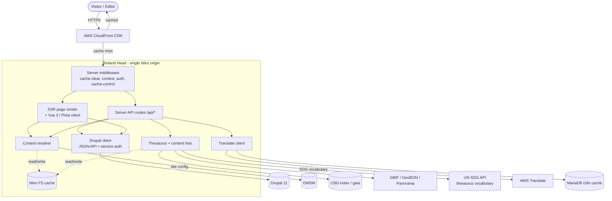
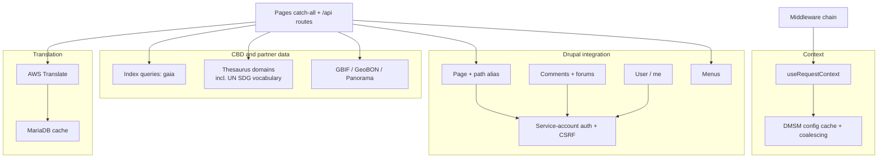
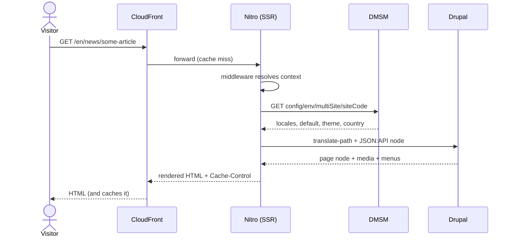
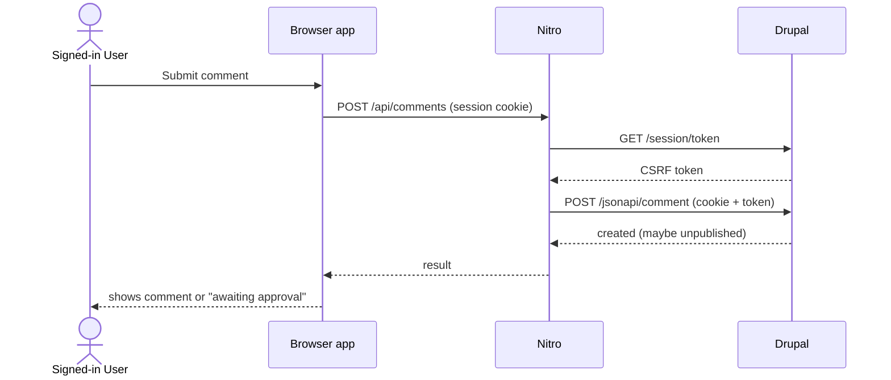
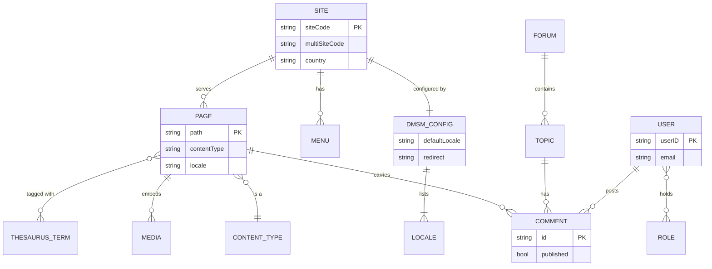
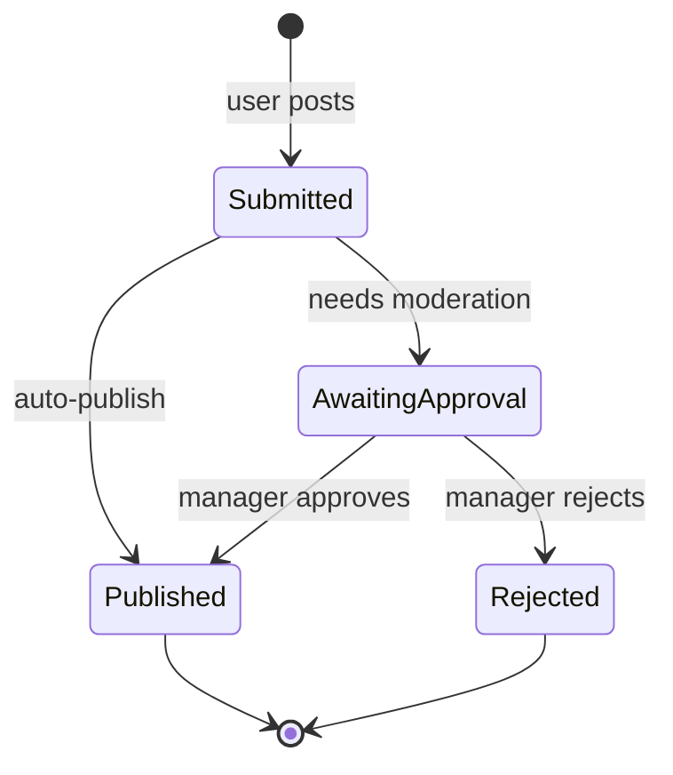
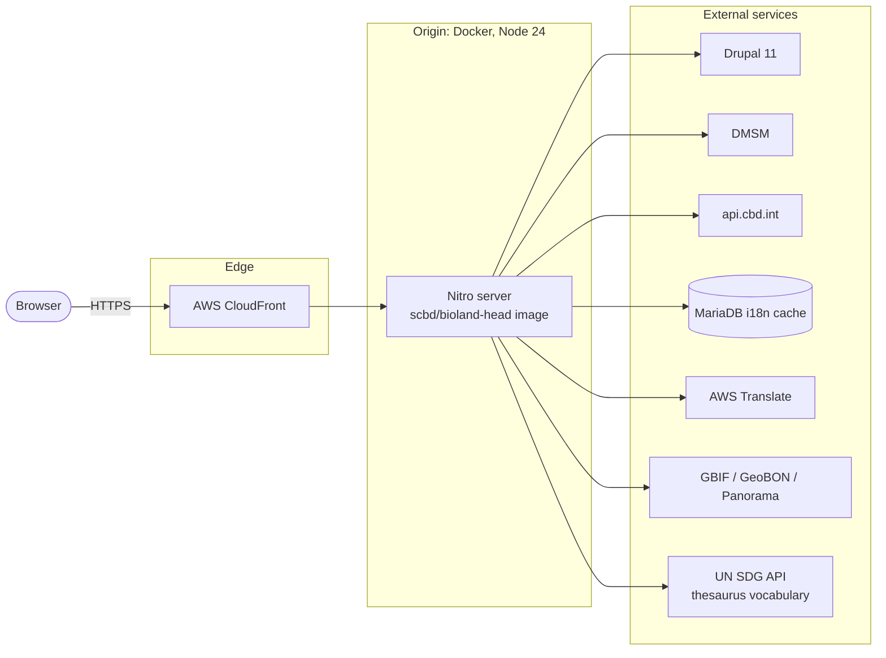

# Bioland Head Architecture

> A living, diagram-first overview of how the platform fits together. Terms in **bold** are defined
> in [docs/CONTEXT.md](./CONTEXT.md). The product rationale is in [docs/prd.md](./prd.md).
>
> All Mermaid diagrams below were validated against the current renderer. C4 is used only at Level 1
> (System Context); containers, components, and deployment use plain `flowchart` for portability.

## 1. Overview

Bioland Head is a single Nuxt 4 application that serves hundreds of CBD **Site**s from one
deployment. It resolves which **Site** a request belongs to from the host subdomain, loads that
Site's configuration from **DMSM**, then renders pages server-side on Nitro using content from a
headless **Drupal** backend and biodiversity data from the **gaia** index and partner services. AWS
CloudFront caches the rendered output so the one origin stays cheap under the load of the whole
estate.

The architecture is shaped by three forces: multi-tenancy resolved per request, a strict separation
between this presentation layer and the systems that own the data, and aggressive caching at every
layer (CDN, server filesystem, and a translation cache) to keep a read-heavy public site fast.

## 2. System Context (C4 L1)

> Mermaid C4 is experimental. If a renderer lacks C4 support, read this as: three kinds of person
> (Visitor, Editor/Manager, SCBD Staff) reach the platform through CloudFront, and the platform reads
> from DMSM, Drupal, gaia, and several biodiversity services.

## 3. Containers (C4 L2)

The containers in one sentence each:

- **Browser app** (Vue 3 + Pinia): the hydrated client. Holds the resolved **Context** in the site
  store and the current **Page**, **User**, and **Menu** state.
- **Nitro server**: the SSR origin. Runs the middleware chain, renders pages, and exposes the
  `/api/*` routes the client and the renderer call.
- **Nitro filesystem cache**: persistent server-side cache for DMSM config, content lists, thesaurus
  lookups, and menus.
- **CloudFront**: edge cache that honours the `Cache-Control` headers the server sets per route class.
- **MariaDB i18n cache**: stores machine-translation results so identical text is translated once.

## 4. Key Components (C4 L3)

Inside the Nitro origin, the building blocks group into four areas: context resolution, the Drupal
client, the CBD and partner data clients, and translation.

The server middleware runs in a fixed order, and everything downstream depends on it:

1. **cache-clear**: lets a manager with the right **Role** bypass and invalidate a **Site**'s cache
   with a query parameter (`seachain-taisce`), gated on the manager admin **Role**.
2. **context**: resolves the **Context** once and caches it on the request, skipping static and
   `/api` paths (those call the resolver directly when they need it).
3. **auth**: reads the **User** from the Drupal session cookie and computes the **Role** flags used
   for edit gating and CSRF.
4. **cache-control**: sets the `Cache-Control` header for the route class.

## 5. Key Flows

### 5.1 Resolving and rendering a page

The **siteCode** comes from the host subdomain; the **Locale** is resolved by priority (explicit,
query, URL path, context cookie, then the DMSM default). DMSM config is cached for a few minutes with
in-flight coalescing so a burst of cold requests for one Site makes a single upstream call.

### 5.2 Posting a comment (authenticated)

Reads for a specific **User** pass that user's own Drupal session through. General content reads use a
service account whose session is cached per **Site**.

## 6. Data Model

These are the domain entities the frontend works with, drawn from the systems that own them. Bioland
Head stores none of this itself; it reads and shapes it per request.

Ownership: **DMSM_CONFIG** is owned by DMSM; **PAGE**, **MENU**, **FORUM**, **TOPIC**, **COMMENT**,
**MEDIA**, **USER**, and **ROLE** by Drupal; **THESAURUS_TERM** by gaia.

## 7. State Machines

A **Comment** is the one genuinely stateful entity the frontend surfaces. Whether a new comment is
published immediately or held depends on Drupal's moderation settings; the frontend shows held
comments only to their author and to managers.

## 8. Deployment / Infrastructure

The same image runs in three **Environment**s, each reaching its own upstreams and host pattern:

| Environment | Host pattern (example) |
|-------------|------------------------|
| dev | `be.localhost:3000/en` |
| stg | `be.stg.chm-cbd.net/en` |
| prod | `be.bl2.chm-cbd.net/en` (country CHM), `*.bsl.cbddev.xyz` (biosafety) |

Onboarding a new **Site** is a configuration change: add its DMSM entry and its host. No code change
or redeploy is required.

## 9. Quality Attributes (NFRs)

| Attribute | Target | How the architecture meets it |
|-----------|--------|-------------------------------|
| Performance | Fast first byte for a read-heavy public site | SSR plus CloudFront edge cache; short-lived dynamic cache with stale-while-revalidate; one-year max-age (with stale-if-error) for build assets |
| Scalability | One origin serves the whole estate of Sites | Stateless per-request tenancy from the host; DMSM config cached with in-flight coalescing to avoid thundering herd; server-side caches for lists, menus, and thesaurus |
| Multi-tenant isolation | A request resolves to exactly its Site, or fails closed | siteCode derived from host on the server; missing or unknown Site raises a 400/404 rather than serving another Site's content |
| Availability | A missing translation never yields an empty page | English is always in a Site's locale set as the fallback; context resolution failures are logged and degraded, not fatal |
| Internationalisation | 80+ locales, including RTL | Locale-prefixed routing gated on the server against DMSM; app-locale to Drupal-langcode mapping; RTL handling for the relevant scripts |
| Security | No cross-tenant or auth leakage | Service-account session cached per Site; visitor sessions passed through only for user-specific reads and comment posts with CSRF; user and forum topic (thread) routes never cached (forum listings use the short dynamic cache) |
| Observability | Diagnosable per request | Structured logging via consola with a configurable level; optional request/outbound logging toggles |
| SEO | Correct indexing across Sites and languages | Per-page canonical and alternate-language links, structured data, and per-locale sitemaps |

## 10. Architecture Decisions

No ADRs are recorded yet (`docs/adr/` does not exist). The following decisions are load-bearing and
worth capturing through the `docs-adrs` skill, each because it is hard to reverse and surprising
without context:

- Host-subdomain tenancy resolved server-side, with query and cookie fallbacks for internal fetches.
- DMSM as the single source of truth for per-Site locales and configuration (locale bugs are fixed
  in DMSM, not in code).
- Unsupported-locale gating done on the server only, because the client's view of a Site's locales is
  stale during hydration.
- The CloudFront cache-tier policy (one-year max-age assets with stale-if-error, short
  stale-while-revalidate pages, no-store user and forum-topic routes).
- Headless Drupal auth: service account cached per Site plus visitor-session passthrough with CSRF
  for mutations.

When an ADR is written, link it here and keep the rationale there rather than in this document.

## 11. Risks & Open Questions

- **DMSM is a hard dependency for every request.** If DMSM is slow or down, Site resolution suffers.
  The short cache and request coalescing soften this, but a stale-serving fallback for DMSM outages
  is an open question.
- **The translation cache is a stateful service** (MariaDB) alongside an otherwise stateless origin.
  Its availability and schema migrations need an owner.
- **Cache invalidation spans layers** (CloudFront, the Nitro filesystem cache, and per-Site keys).
  The manager-triggered clear path exists; confirming it reaches every layer is worth a test.
- **Locale and Drupal langcode can diverge** (the app `zh` maps to Drupal `zh-hans`, `tl` to `fil`).
  New Sites with unusual language codes are a recurring source of locale bugs.
- **Partner data sources vary in reliability and shape** (GBIF, GeoBON, Panorama, the UN SDG API).
  Widget-level failures should degrade quietly rather than break a home page.
